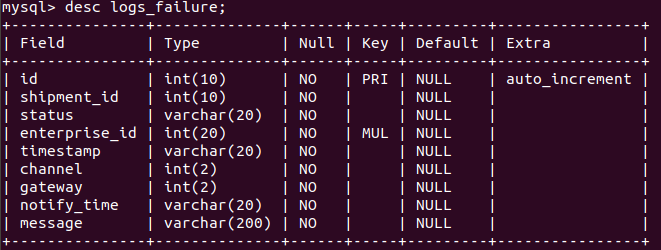
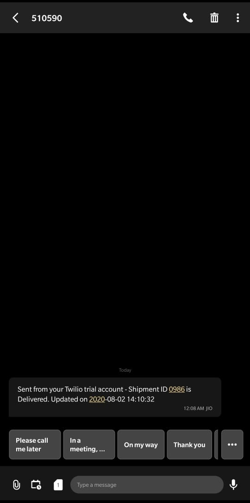

<b><u><h1>notify-api</h1></b></u>

A small API for handling order status updates and sending notifications through selected channels.

<b><u><h2>Features implemented:</h2></b></u>

1. Push notifications through subscribed channels.

2. Logging updates for both success and failure.

3. Maintaining channel and gateway info for each enterprise.

4. Add new channels and gateways.

5. List all channels and gateways.

6. Basic data hygience checks - input data missing, input data validation.

<b><u><h2>Stack:</h2></b></u>

1. Python.

2. Flask.

3. MySQL.

<b><u><h2>Notification Services Used:</h2></b></u>

1. [Twilio for SMS](https://www.twilio.com/messaging)

2. [SendGrid for Email](https://www.twilio.com/sendgrid/email-api)

3. [Twilio for Whatsapp](https://www.twilio.com/whatsapp)

<b><u><h2>Routes:</h2></b></u>

1. <b>/</b> - default route with POST method and json input for updating order status.

2. <b>/</b> - default route with GET method for handling error route.

3. <b>/add-channel-gateway</b> with POST method and json input for creating new channel and gateway.

4. <b>/fetch-channels-gateways</b> with GET method for fetching all channels and gateways.

<b><u><h2>Tables:</h2></b></u>

1. <b>customers</b> : information about enterprise - id, is subscribed for notifications, phone and email.

2. <b>channels</b> : information about channels - id, name.

3. <b>gateways</b> : information about gateways - id, name and channel it is associated with.

4. <b>subscriptions</b> : information about channels and gateways an enterprise is subscribed to. There can be none and there can be many. Contains - enterprise id, channel id and gateway id.

5. <b>logs</b> : information about successful notification through selected channels to enterprises. Contains - all order status, enterprise id, channel id, gateway id and logging time.

6. <b>Logs_failure</b> : information about all notifications that were not sent due to service API failures, customer not subscribed to any notification service, customer subscription data missing. Contains - all order status, enterprise id, channel id, gateway id, logging time and reason for failure.

<b><u><h2>For a successful run, you need:</h2></b></u>

1. All Twilio configurations for successful notifications (Auth Key and relevant phone numbers).
2. Enterprise, channel, gateway and enterprise subscription table entries already created.

<b><u><h2>Notification received:</h2></b></u>

1. SMS
   
2. Email
   
3. Whatsapp
   
